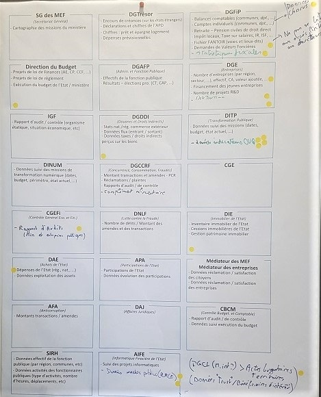

# Atelier - Bercy Open Data
*Le mercredi 22 janvier 2020, le **[Secrétariat Général des Ministères Economiques et Financiers](https://www.economie.gouv.fr/vous-orienter/organigramme/secretariat-general-des-ministeres-economiques-et-financiers-sg)** a organisé un **atelier de réflexion et d'idéation** sur les **démarches Open Data** du ministère et les **impacts** associés. Une quinzaine d'utilisateurs finaux et d'acteurs de l'écosystème Open Data ont répondu présents à l'invitation.*
***
### Introduction
Après de premières initiatives d'ouverture de données, dont la publication des données sur le portail [data.gouv.fr](https://data.gouv.fr) et la mise en place d'un portail dédié au ministère [data.economie.gouv.fr](https://data.economie.gouv.fr), le Ministère de l'Economie et des Finances a souhaité **mobiliser et échanger avec les utilisateurs finaux** des données ouvertes, afin de mieux répondre à leurs besoins et ainsi, renforcer les liens de confiance et de transparence avec eux et leur donner les moyens d'innover et de générer de l'impact économique avec les données ouvertes. 

Ce premier atelier a eu lieu au sein de [BercyLab](https://www.economie.gouv.fr/mission-innovation/bienvenue-au-bercylab), un espace conçu pour favoriser la créativité et le travail collaboratif, et a permis de comprendre ce que représente l'Open Data pour les utilisateurs, d'identifier les données du Ministère considérées comme étant les "golden data" et de caractériser les différentes typologies des utilisateurs des données ouvertes. Les échanges qui ont eu lieu au cours de cet atelier ont également permis d'identifier les freins rencontrés par les utilisateurs aujourd'hui, et des premiers axes de travail qui sont réellement *user-centric*.

Cet article retrace le déroulement de l'atelier et synthétise les différents échanges qui y ont eu lieu, ainsi que les premières actions qui en découlent.

### "Que vous inspire l'Open Data ?"
Pour initialiser ce travail de co-construction de la démarche Open Data du ministère, un premier exercice *warm up* a permis d'identifier les grands sujets autour de l'Open Data selon les utilisateurs. 
Les participants ont été séparés en deux groupes, et en quelques minutes de travail collaboratif, chaque groupe devait remplir le graphe ci-dessous avec des sujets que leur inspire l'Open Data, chaque mot devant avoir un lien avec le mot auquel il est relié. 

  

Chaque groupe a ensuite effacé les mots centraux et essayé de reconstituer le graphe du groupe opposé à partir des mots restants. Hormis quelques différences, les deux groupes ont identifié les mêmes grandes thématiques autour de l'Open Data.

  

  

Cet exercice a permis de mettre en avant plusieurs sujets centraux autour de l'Open Data, identifiés par les deux groupes : 
* **Culture** open data, **structuration** de la collecte et de la publication des données
* **Transparence** et droit d'accès à l'information
* **Valorisation des données ouvertes** : sujet le plus cité, correspond à la qualité et la granularité des données publiées, la documentation de celles-ci, leur mise à jour régulière, etc.

Ces sujets reflètent une réelle volonté des participants d'explorer et de tirer de la valeur des données du ministère. Pour répondre à cette volonté, il importe d'identifier les jeux de données du ministère qui intéressent le plus les utilisateurs...

### Les Golden Data
Pour répondre à cette question, une **cartographie représentative des données du ministère** (mais non exhaustive) a été présentée aux participants. Les participants ont ensuite travaillé en groupe pour désigner les jeux de données qu'ils considèrent comme étant des "*golden data*", chaque groupe ayant un nombre limité de votes à répartir sur les différents jeux de données. 

  

Cet exercice a permis d'aboutir aux constats suivants :
* Certains jeux de données portent plus de valeur aux yeux des participants : les **données budget**, **les données DGFiP**, **les données sur les dépenses et les achats de l'Etat**, entre autres
* **La valorisation de ces jeux de données n'est cependant possible que dans la mesure où les éléments sur la qualité et l'utilisabilité des données, identifiés durant le premier exercice, sont respectés**
* **Seuls, plusieurs jeux de données sont difficilement exploitables et leur exploitation aurait peu d'impact. C'est la jointure de plusieurs jeux de données qui permettrait de valoriser réellement ces données. Ainsi, il est primordial de mettre en place des référentiels *(données pivots, conventions, documentation et metadata)* qui permettraient cette valorisation.**

### Les typologies d'utilsateurs
Quelles données pour quelle catégorie d'utilisateurs ? Sous quels formats ?

  

Cet exercice a permis d'aboutir aux constats suivants :
* **Absence de toute événementialisation autour des jeux de données publiées. Cela rend l'accès à ces informations difficile, principalement pour les "citoyens curieux" ou des utilisateurs type data journalist. Evénementialiser un jeu de données publié ou à publier, à travers des articles "décryptage" par exemple, à destination du grand public, contribuerait significativement à une prise de conscience citoyenne sur le rôle de l'Open Data dans le renforcement des liens de transparence et de confiance Etat-Citoyens**
* **Pour les power users, les formats de données souhaités ne seront pas intelligible auprès des autres catégories d'utilisateurs. Par ailleurs, si on souhaite que les power users valorisent les données publiées, il faut s'engager à respecter les critères de qualité cités précédemment. Fournir des données qui respectent ces éléments permettra aux power users de générer de la valeur grâce à des traitements avancés (Big Data, IA), mais aussi de construire des rapports informatifs à destination du grand public**
---
### Points marquants

