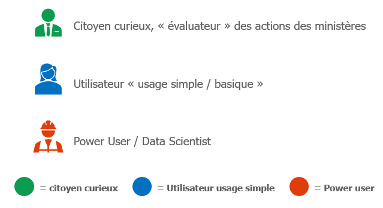

# Atelier - Bercy Open Data
*Le mercredi 22 janvier 2020, le **[Secrétariat Général des Ministères Economiques et Financiers](https://www.economie.gouv.fr/vous-orienter/organigramme/secretariat-general-des-ministeres-economiques-et-financiers-sg)** a organisé un **atelier de réflexion et d'idéation** sur les **démarches Open Data** des ministères et les **impacts** associés. Une quinzaine d'utilisateurs finaux et d'acteurs de l'écosystème Open Data ont répondu présents à l'invitation.*
***
## Introduction
Après de premières initiatives Open Data, dont la publication de données sur le portail [data.gouv.fr](https://data.gouv.fr) et la mise en place d'un portail dédié aux MEF [data.economie.gouv.fr](https://data.economie.gouv.fr), le Secrétariat Général des Ministères Economiques et Financiers a souhaité **mobiliser et échanger avec les utilisateurs finaux** des données ouvertes. Cette action reflète la volonté des ministères de mieux répondre aux besoins des utilisateurs et ainsi renforcer les liens de confiance et de transparence avec eux et leur donner les moyens d'innover et de générer un impact économique avec les données ouvertes. 

Ce premier atelier a eu lieu au sein de **Station C**, un espace conçu pour favoriser la créativité et le travail collaboratif, et a permis de comprendre ce que représente l'Open Data pour les utilisateurs, d'identifier les données des Ministères considérées comme étant des *Golden Data* et de caractériser les différentes typologies des utilisateurs des données ouvertes. Les échanges qui ont eu lieu au cours de cet atelier ont également permis d'identifier les freins rencontrés par les utilisateurs aujourd'hui, et des premiers axes de travail pour y remédier.

Cet article retrace le déroulement de l'atelier et synthétise les différents échanges qui y ont eu lieu, ainsi que les premières actions qui en découlent.

  

## "Que vous inspire l'Open Data ?"
Pour initialiser ce travail de co-construction de la démarche Open Data des MEF, un premier exercice *warm-up* a permis d'identifier les grands sujets autour de l'Open Data du point de vue des utilisateurs. 
Les participants ont été séparés en deux groupes, et en quelques minutes de travail collaboratif, chaque groupe devait remplir le graphe ci-dessous avec des sujets que leur inspire l'Open Data, chaque mot devant avoir un lien avec le mot auquel il est relié. 

  

Chaque groupe a ensuite effacé les mots centraux et essayé de reconstituer le graphe du groupe opposé à partir des mots restants. Hormis quelques différences, les deux groupes ont identifié les mêmes grandes thématiques autour de l'Open Data.

  

Cet exercice a permis de mettre en avant plusieurs sujets centraux autour de l'Open Data, identifiés par les deux groupes : 
* **Culture** Open Data, **structuration** de la collecte et de la publication des données
* **Transparence** et droit d'accès à l'information
* **Usage et valorisation des données ouvertes** : sujet le plus cité, correspond à la qualité et la granularité des données publiées, la documentation de celles-ci, leur mise à jour régulière, etc.

Ces sujets reflètent une réelle volonté des participants d'explorer et d'extraire de la valeur des données des MEF. Pour répondre à cette volonté, il importe d'identifier les jeux de données du ministère qui intéressent le plus les utilisateurs...

## Les Golden Data
Pour répondre à cette question, une **liste de jeux de données des MEF** a été présentée aux participants. Les participants ont travaillé en groupe pour compléter la liste avec des données incarnant l'image des MEF, puis pour désigner des jeux de données emblématiques (qu'on appelle ici *Golden Data*), chaque groupe ayant un nombre limité de votes à répartir sur les différents jeux de données. 

  

Les constats suivants ont été réalisés à l'issue de cet exercice :
* Certains jeux de données portent plus de valeur aux yeux des participants : les **données budget**, **les données fiscales**, **les données sur les dépenses et les achats de l'Etat**
* La valorisation de ces jeux de données est possible **dés lors que les critères de qualité, d'utilisabilité et de documentation** sont respectés
* L'intérêt d'un jeu de données seul n'est pas énorme. En revanche, **croisé avec d'autres jeux de données**, celui-ci prend son sens et **les données brutes deviennent des informations exploitables**. Ainsi, il est primordial de mettre en place **des référentiels permettant la jointure de plusieurs jeux de données** *(données pivots, conventions, documentation, etc. )*

## Les typologies d'utilsateurs
Le dernier exercice de l'atelier consistait à identifier les jeux de données (parmi les *Golden Data*) qui intéresseraient le plus chaque typologie d'utilisateurs. Pour cela, trois profils d'utilisateur type ont été proposés aux participants.

  

Durant cet exercice, les participants ont soulevé les points suivants :
* Absence **d'orientation éditoriale et d'événement** autour des données publiées. Cela rend l'accès à ces informations difficile, principalement pour les "citoyens curieux" ou des utilisateurs type "Data Journalist". La publication des données avec davantage de **pédagogie** contribuerait significativement à une prise de conscience citoyenne sur le rôle de l'Open Data dans le renforcement des liens de transparence et de confiance Etat-Citoyens
* Les Power Users souhaitent avoir accès à des **données brutes, régulièrement mises à jour et avec une granularité suffisemment fine** pour pouvoir les exploiter et en tirer de la valeur
* Ce format ne correspond cependant pas aux attentes des autres utilisateurs. Les Power Users peuvent ainsi apporter un complément aux données fournies par l'administration. En effet, fournir des données qui respectent les critères d'utilisabilité cités précédemment permettra aux Power Users de générer de la valeur grâce à des traitements avancés (Big Data, IA), mais aussi de construire des jeux de données agrégés et des rapports informatifs à destination du grand public

***

